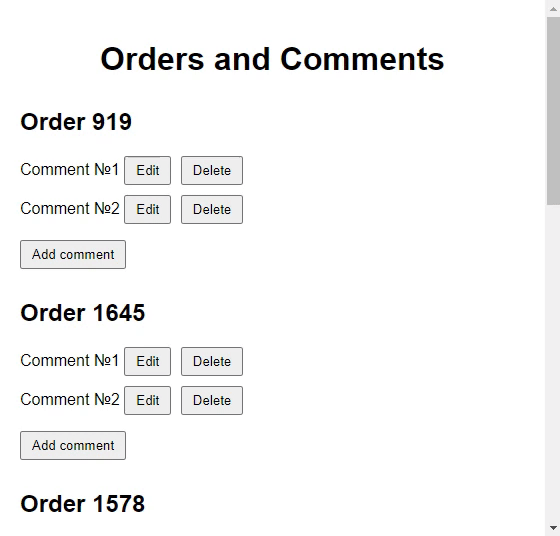

# How it works

My task was to create an Order Comments Management application
using JavaScript and Thymeleaf for a ready to use SpringBoot basic Controller. The application allows to add, edit, and
delete comments for different orders. The comments are stored on the server
side and rendered using Thymeleaf on the front end. The application also has
basic validation to ensure that users cannot submit empty comments.